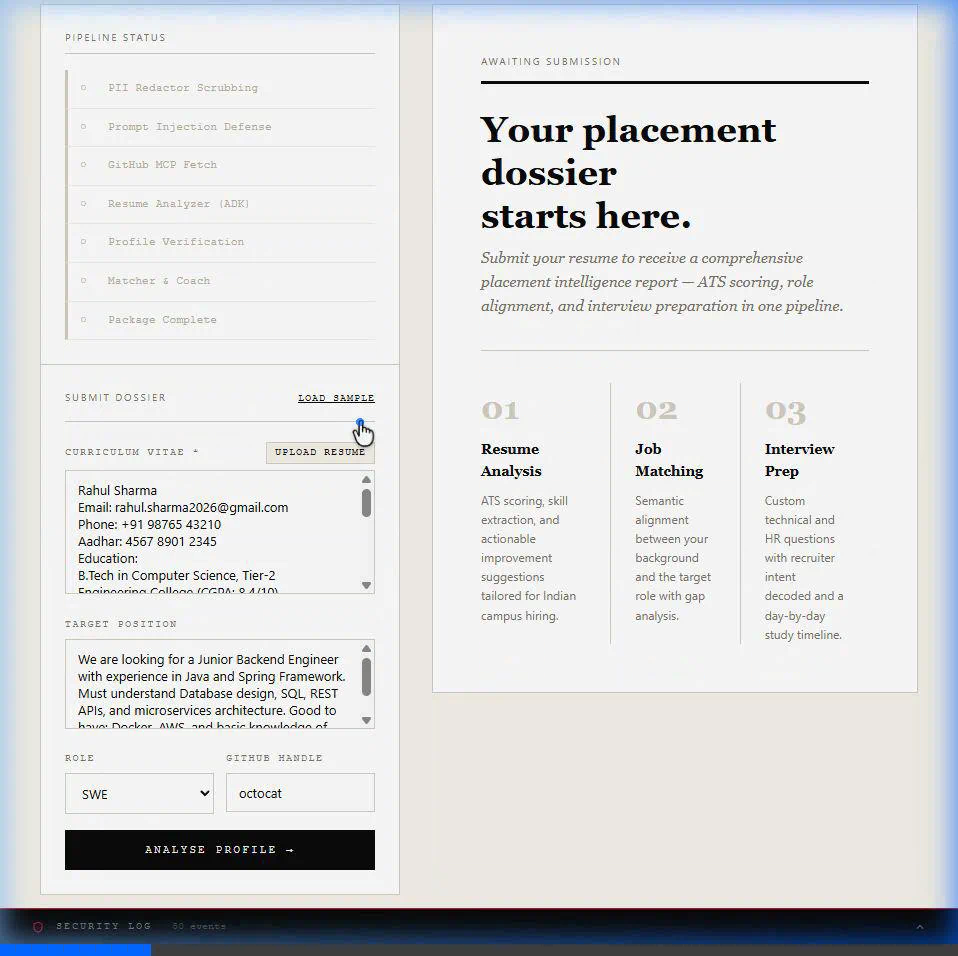
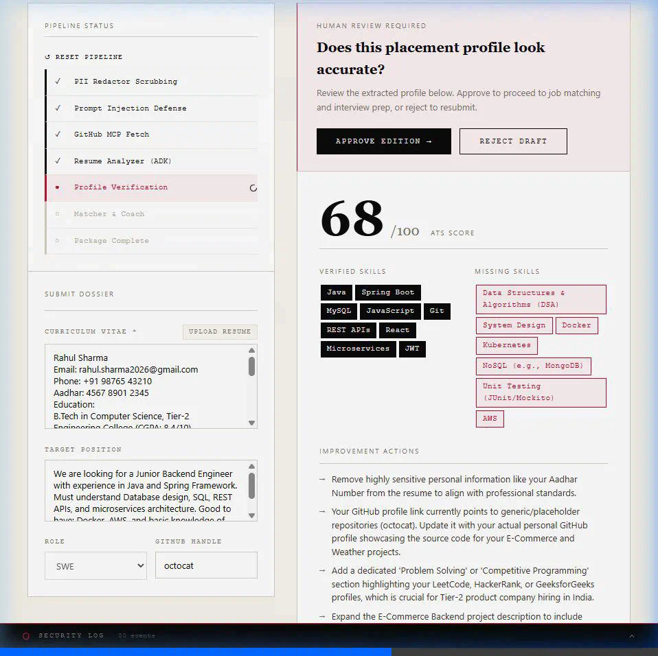
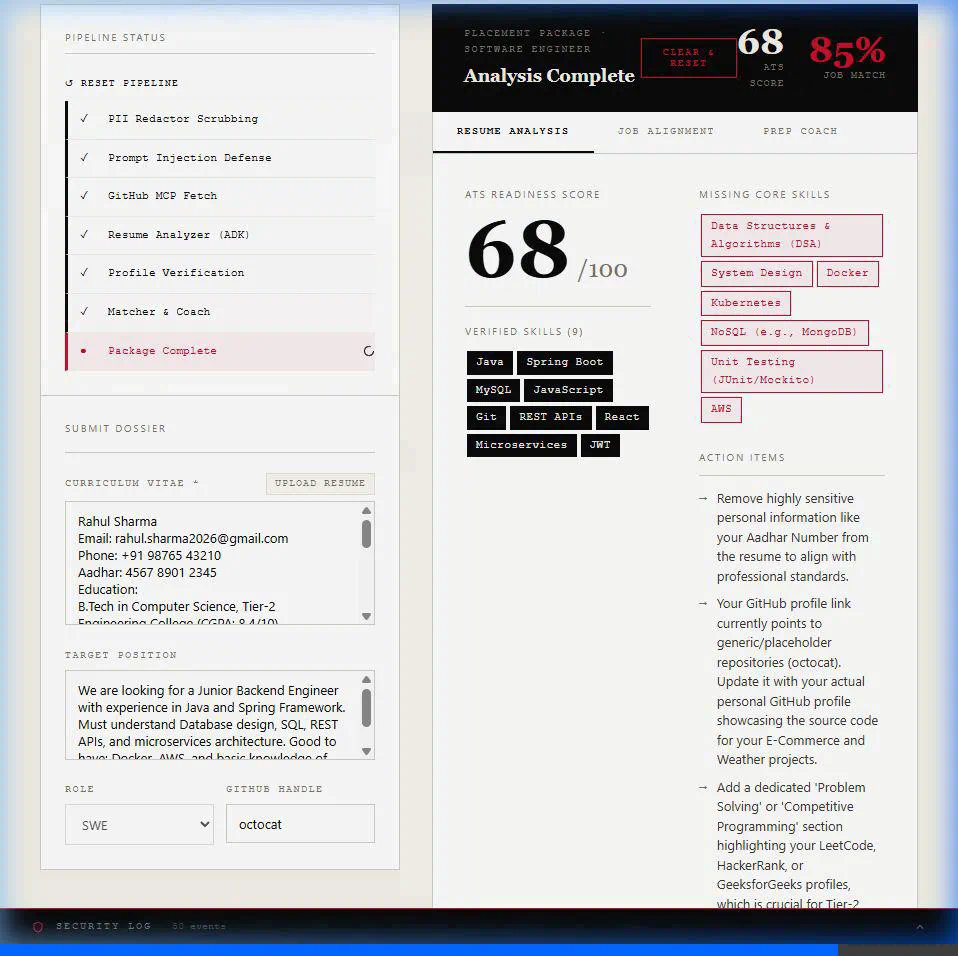
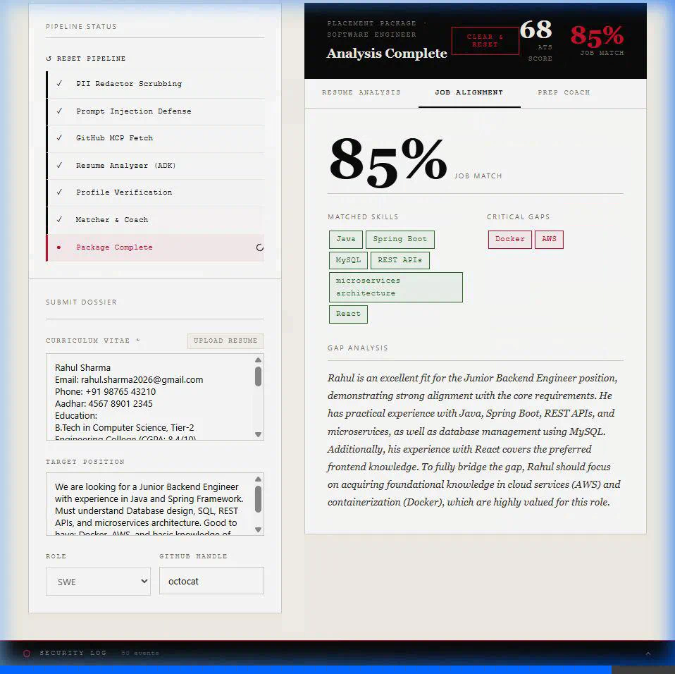
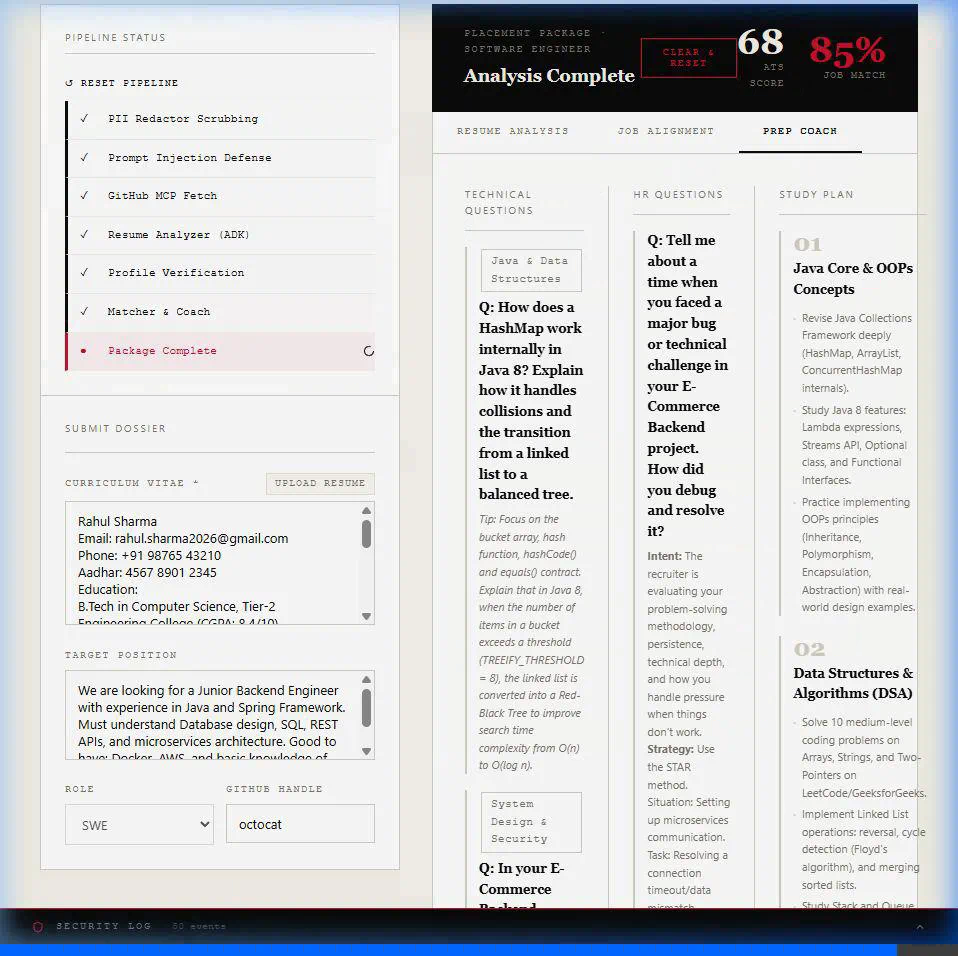
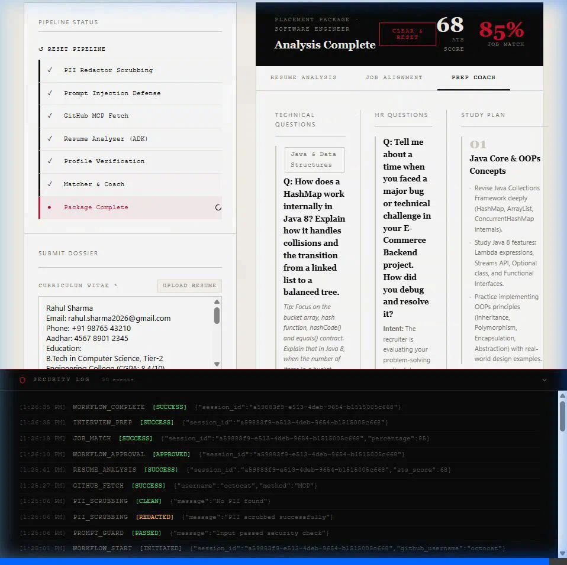

# CareerCopilot AI 🎓
### Multi-Agent Campus Placement Suite for Indian Engineering Students

> Built for the **Kaggle 5-Day AI Agents Capstone 2026** — Agents for Business Track

[](https://python.org)
[](https://google.github.io/adk-docs/)
[](https://ai.google.dev)
[](https://fastapi.tiangolo.com)
[](https://react.dev)
[](LICENSE)

---

## 🗞️ Overview

CareerCopilot AI is a production-grade multi-agent placement preparation platform built with Google ADK and Gemini 2.5 Flash. It solves the real problem faced by Indian engineering students — spending hours on fragmented tools for resume checking, job matching, and interview prep.

**CareerCopilot combines all three into one intelligent pipeline.**

---

## 🎬 Demo Walkthrough

### Landing Page


### Human-in-the-Loop Review


### Resume Analysis Dashboard


### Job Alignment Report


### Interview Prep Coach


### Security Audit Log


---

## 📊 Test Results

| Target Role | ATS Score | Job Match | Status |
|---|---|---|---|
| Software Engineer | 82/100 | 98% | ✅ PASS |
| Full Stack Developer | 20/100 | 20% | ✅ PASS |
| Data Analyst | 78/100 | 95% | ✅ PASS |
| UI/UX Designer | 78/100 | 95% | ✅ PASS |

**Security:**
- ✅ Email redacted successfully
- ✅ Phone redacted successfully
- ✅ GitHub MCP connected
- ✅ Prompt injection blocked
- ✅ All 6 unit tests passed

---

## 🤖 Agent Architecture
User Input (Resume + JD + GitHub)
↓
Security Guards
├── PII Redactor (Regex)
└── Prompt Injection Firewall (Gemini)
↓
GitHub MCP Client
↓
┌─────────────────────────────────┐
│      Root Orchestrator (ADK)    │
└─────────────────────────────────┘
↓              ↓            ↓
Agent 1        Agent 2      Agent 3
Resume       Job Matcher  Interview
Analyzer     (Gemini)     Coach
(ADK)                     (Gemini)
↓
[HITL: Human Approval Required]
↓
Final Placement Intelligence Report

---

## ⚙️ Course Concepts Demonstrated

| Concept | Implementation |
|---|---|
| ✅ Multi-Agent System (ADK) | Resume Analyzer + Job Matcher + Interview Coach |
| ✅ MCP Server | GitHub MCP stdio + HTTP fallback |
| ✅ Security Features | PII redaction + Prompt injection firewall |
| ✅ Human-in-the-Loop | Phase 1 → Approve/Reject → Phase 2 |
| ✅ Agent Skills | Orchestrator managing sequential agents |
| ✅ Vibe Coding | Built using Antigravity IDE |

---

## 🚀 Setup & Installation

### Prerequisites
- Python 3.11+
- Node.js 18+
- Google AI Studio API Key (free)
- GitHub Personal Access Token (optional)

### 1. Clone Repository
```bash
git clone https://github.com/lakshr2004/career-copilot.git
cd career-copilot
```

### 2. Backend Setup
```bash
pip install -r requirements.txt
```

Create `.env` file:
```env
GOOGLE_API_KEY=your_gemini_api_key_here
GITHUB_PERSONAL_ACCESS_TOKEN=your_github_token_here
PORT=8000
```

### 3. Frontend Setup
```bash
npm install
```

### 4. Run
```bash
# Terminal 1
python main.py

# Terminal 2
npm run dev
```

Open `http://localhost:5173`

---

## 📁 Project Structure
career-copilot/
├── main.py                 # FastAPI server
├── orchestrator.py         # Two-phase pipeline
├── resume_analyzer.py      # Agent 1: ADK resume evaluation
├── job_matcher.py          # Agent 2: Job matching
├── interview_coach.py      # Agent 3: Interview prep
├── guards.py               # PII + injection guard
├── github_mcp.py           # GitHub MCP client
├── requirements.txt
├── src/
│   ├── App.jsx             # React dashboard
│   └── index.css           # Editorial design system
├── tests/
│   └── test_agents.py      # 6 unit tests
├── assets/                 # Screenshots
└── README.md

---

## 🔒 Security Features

- PII Redaction: Phone, email, Aadhar auto-scrubbed
- Prompt Injection Firewall: Gemini-powered classifier
- Audit Logging: All events in security/audit.log
- No hardcoded API keys

---

## 👨💻 Author

**Laksh** — B.Tech Information Technology
Asansol Engineering College (MAKAUT), 2027
[GitHub](https://github.com/lakshr2004)

---

## 📄 License

CC BY 4.0 — Kaggle Capstone competition requirement.

---

*Built with Google ADK, Gemini 2.5 Flash, and Antigravity IDE*
